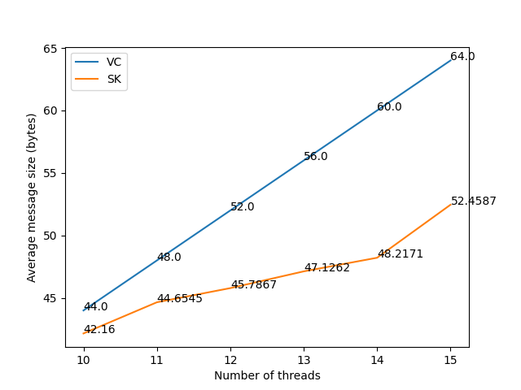

# Structs

## Params

Fields as per input format.

## Node

### Fields

- `recvr`: A `ZMQ_ROUTER` socket that recieves messages from other nodes.
- `socks`: Vector of `ZMQ_PAIR` sockets that send messages to other nodes.
- `vtime`: Vector clock.
- `dist`: A uniform distribution for selecting a random node to send a message to.

### Methods

- `init_dist`: Initializes the uniform distribution.
- `recv_handler`: Handles messages recieved by the `recvr` socket.
- `send_handler`: Sends a message to a random node.
- `thread_fn`: Thread business logic.
- Constructor

## SKNode

Inherits `Node`.

- Fields `ls`, `lu`: As per the SK differential technique.

## Graph<T>

Template class for the graph. Used as `Graph<Node>` and `Graph<SKNode>`.

### Fields

- `nodes`: Vector of `Node` pointers.
- `zmq_ctx`: ZeroMQ context.

### Methods

- Constructor: Responsible for initializing the ZeroMQ context and creating the node topology.
- `thread_spawn`: Spawns a thread for each node, and collects their outputs.

## Context<T>

Contains both the `Graph` and `Params` objects. Used as `Context<Node>` and `Context<SKNode>`.

## LogEntry

### Fields

- `time`: Time of the log entry.
- `event`: Event type.
- `clock`: Vector clock at the time of the event.
- `space`: Message size when relevant.
- `tid`: Thread ID.

## Log

Wrapper around a vector of `LogEntry` objects. Contains all the logging information of the system.

# Files

- `src/`
  - `structs.cpp`: Main file. Contains the implementation of both algorithms. Due to inheritance and templates, it was much cleaner to write both in one file.
  - `VC-cs21btech11001.cpp`: Contains the `main` function for the VC algorithm.
  - `SK-cs21btech11001.cpp`: Contains the `main` function for the SK algorithm.
- `inp-params.txt`: Input file.
- `plot.py`: Python script to plot the graph.
- `run.sh`: Script to compile and run the programs.
- `pdf/`
  - `report.md`: This file.
  - `Assgn1-Report-cs21btech11001.pdf`: Report file.
- `out/`; Created by running `run.sh`
  - Binaries
  - Log files: All times in microseconds.

# Program Flow

1. Context is initialised in the main function. This reads the input files, creating the graph and initialising the input parameters.
   1. The graph is created with a constructor call, and depending on the algorithm, the nodes are of type `Node` or `SKNode`.
   2. Both `Context` and `Graph` are template structs, so the type of the nodes is passed as a template parameter.
2. The `thread_spawn` method is called, which spawns a thread for each node, and collects their outputs.
   1. The `Context::thread_spawn` method calls the `Graph::thread_spawn` method, which in turn calls the `thread_init` function for each node. This calls the node's `thread_fn` method.
   2. The `thread_fn` method is the business logic for each node. It calls the `recv_handler` and `send_handler` methods, and logs the events.
   3. The thread returns a pointer to the `Log` object, which is collected by the `Graph::thread_spawn` method.

# Topology

The topology (read from the input file) is a bidirectional ring graph, so that the graph is strongly connected.

# Graph

As expected, the SK differential technique greatly reduces the message size. 

The space complexity of each thread is higher, as it needs to store the `ls` and `lu` arrays also. The space required per thread (in bytes) is:  

| Threads | VC  | SK  |
| -       | -   | -   |
| 10      | 80  | 160 |
| 11      | 84  | 172 |
| 12      | 88  | 184 |
| 13      | 92  | 196 |
| 14      | 96  | 208 |
| 15      | 100 | 220 |
|         |     |     |
